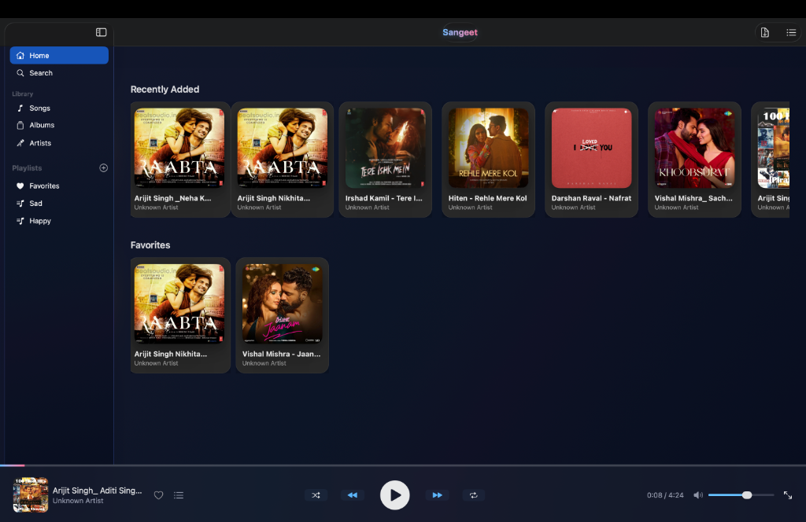

# Sangeet 🎵

A stunning, native macOS music player building with SwiftUI, designed for audiophiles who value aesthetics and performance.



## ✨ Features

- **Glassmorphism UI**: A beautiful, translucent interface that blends perfectly with modern macOS.
- **Professional Audio Engine**:
  - **Smart Crossfade**: Seamlessly transitions between tracks like a radio station.
  - **Soft Play/Pause**: Gentle fade-in and fade-out effects, no harsh cuts.
- **System Integration**:
  - Full support for macOS **Now Playing** widget in Control Center.
  - Native **Media Key** support (Play/Pause, Next, Previous) on keyboards.
- **Library Management**:
  - Auto-scans your music folder.
  - Custom Playlists.
  - Smart Queue with auto-play logic.
  - Favorites system.

## 📥 Installation

1. Go to the [Releases](../../releases) page.
2. Download the latest `Sangeet.dmg`.
3. Open the `.dmg` and drag **Sangeet** to your Applications folder.

### ⚠️ "App cannot be opened" Error?

Since this app is not signed with a $99 Apple Developer account, macOS may block it by default. To open it:

1. **Right-click** (or Control-click) the Sangeet app icon.
2. Select **Open** from the menu.
3. Click **Open** in the dialog box that appears.
*(You only need to do this once)*.

## 🛠️ Built With

- **Swift** & **SwiftUI**
- **AVFoundation**: For the custom dual-node audio engine.
- **MediaPlayer**: For system-level integration.
- **CoreData**: For robust metadata and playlist persistence.

## 🧑‍💻 Development

Want to build it yourself?

1. **Clone the repo**
   ```bash
   git clone https://github.com/YashvardhanATRgithub/Sangeet.git
   cd Sangeet
   ```

2. **Open in Xcode**
   Double-click `Sangeet.xcodeproj`.

3. **Build the App**
   - Select the **Sangeet** scheme.
   - Press `Cmd + B` to build.
   - To run, press `Cmd + R`.

4. **Create DMG Installer** (Optional)
   If you want to package the app for distribution:
   ```bash
   # First, build for Release in Xcode
   # Then run the script:
   ./create_dmg.sh /path/to/your/Sangeet.app
   ```

## 📝 License

This project is open-source and available under the MIT License.
