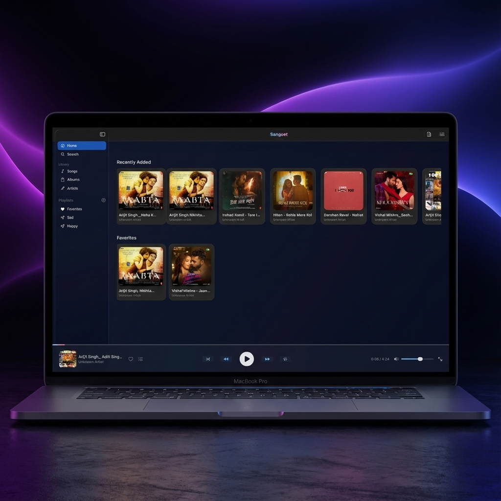
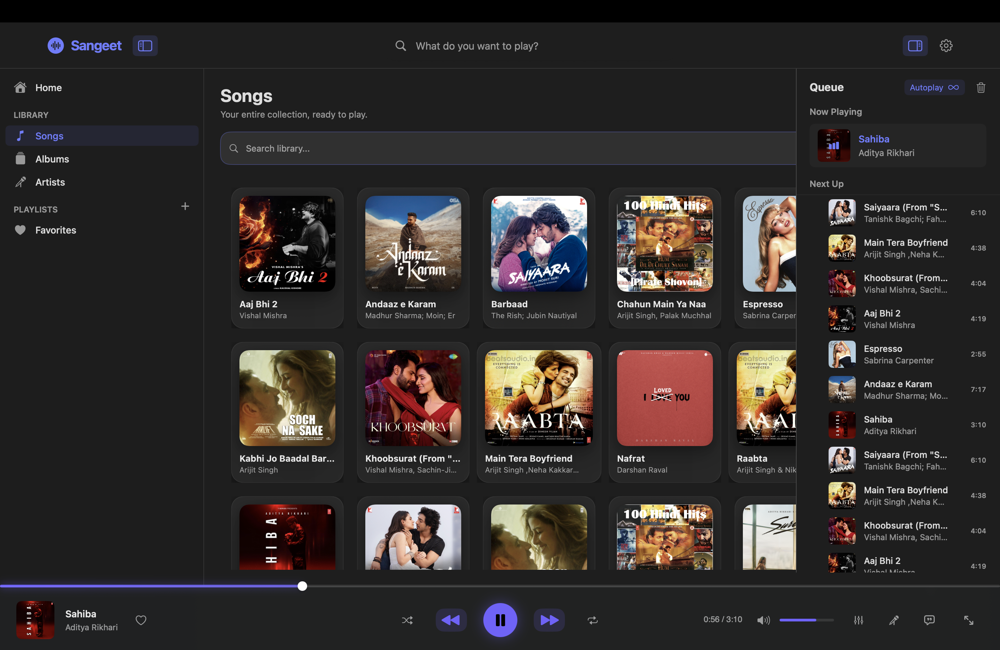
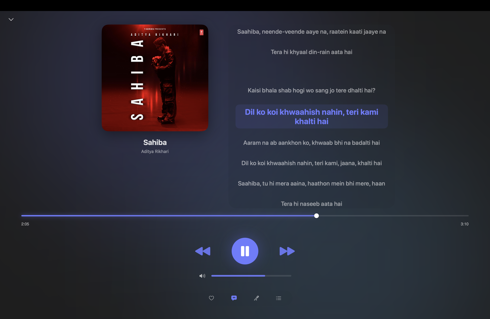
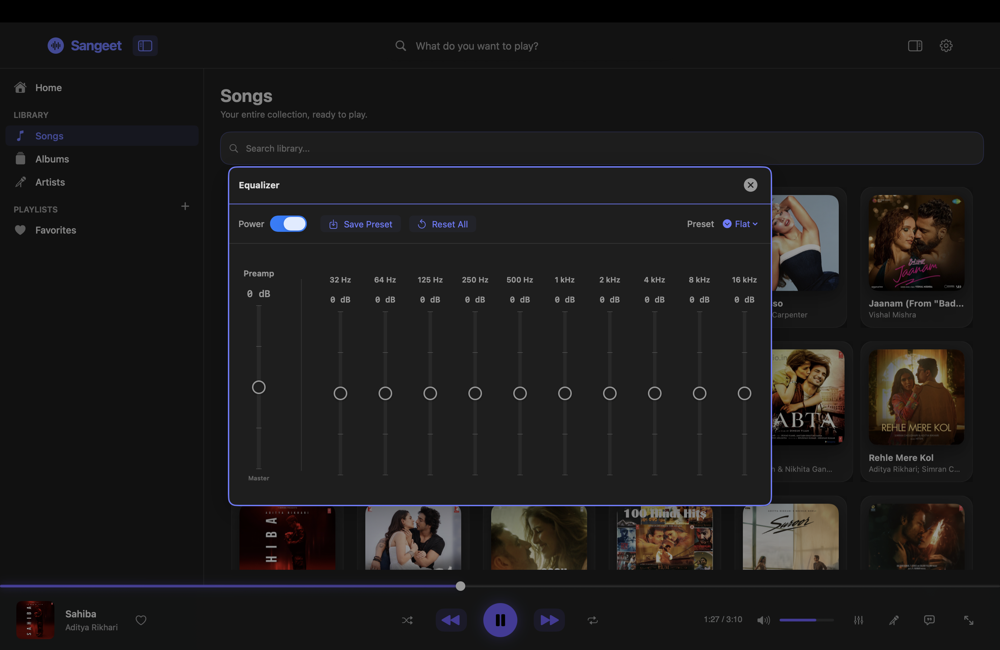
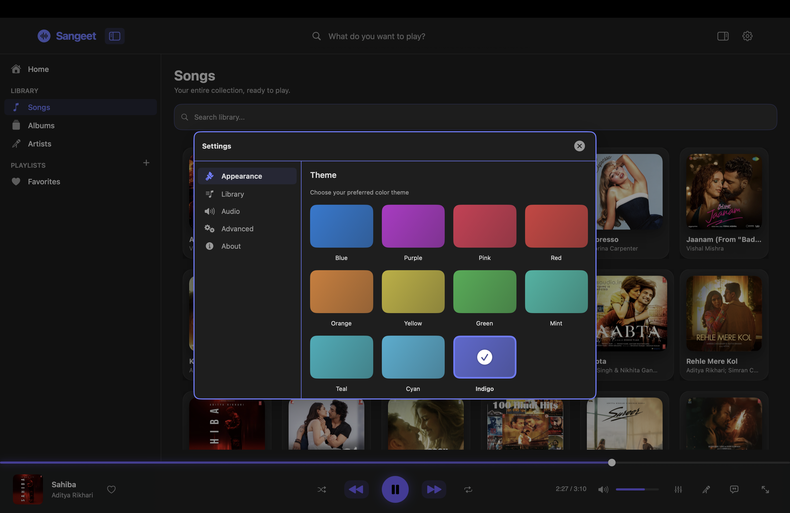
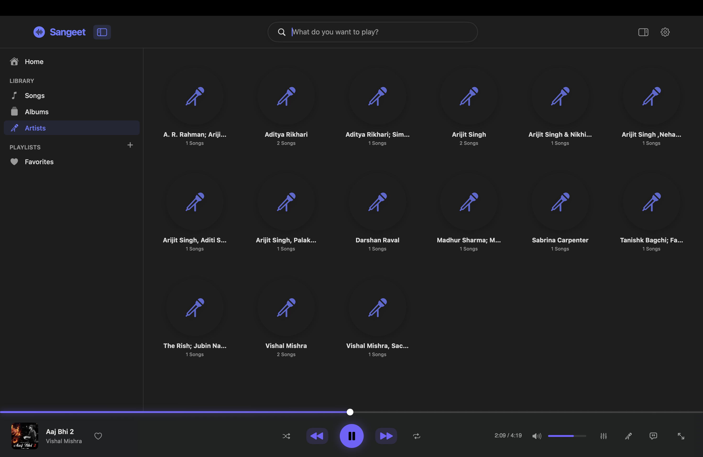

# Sangeet 🎵

A stunning, native macOS music player built with SwiftUI, designed for audiophiles who value aesthetics and performance.



## ✨ Features

### 🎨 Beautiful Modern UI
- **Glassmorphism Design** – Translucent, blur-based interface that blends with macOS
- **Dynamic Theming** – 11 gorgeous accent colors to match your style
- **Full-Screen Player** – Immersive view with ambient background effects
- **Smooth Animations** – Spring-based transitions and hover effects throughout

### 🎛️ Professional Audio Engine
- **10-Band Graphic Equalizer** – Fine-tune your audio with precision
- **15+ Built-in EQ Presets** – Rock, Jazz, Classical, Electronic, and more
- **Custom EQ Presets** – Save your own equalizer configurations
- **🎤 One-Click Karaoke Mode** – Instantly reduce vocals for sing-along sessions
- **Replay Gain Support** – Consistent volume across tracks
- **Smart Crossfade** – Seamless transitions between tracks like a radio station
- **Soft Play/Pause** – Gentle fade-in/fade-out, no harsh cuts
- **Gapless Playback** – Perfect for live albums and continuous mixes

### 📚 Library Management
- **Folder-Based Library** – Auto-scans and indexes your music folders
- **Album & Artist Views** – Browse your collection beautifully
- **Smart Queue** – Auto-play with shuffle and repeat modes
- **Custom Playlists** – Create and manage your own playlists
- **Favorites System** – Quick access to your loved tracks
- **Global Search** – Find any song, album, or artist instantly

### 🔗 System Integration
- **macOS Now Playing** – Full support in Control Center and Touch Bar
- **Media Key Support** – Play/Pause, Next, Previous work natively
- **Lyrics Display** – View synced lyrics in full-screen mode
- **Check for Updates** – One-click update checking via GitHub releases

### ⚙️ Settings & Customization
- **Appearance Settings** – Theme colors and visual preferences
- **Audio Settings** – Crossfade, replay gain, and more
- **Library Settings** – Manage music folders and scanning
- **About Section** – Library statistics and quick links

---

## 📸 Screenshots
### Main Player


### Full-Screen Player


### 10-Band Equalizer


### Settings


### Library View


---

## 📥 Installation

1. Go to the [Releases](https://github.com/YashvardhanATRgithub/Sangeet/releases) page.
2. Download the latest `Sangeet.dmg`.
3. Open the `.dmg` and drag **Sangeet** to your Applications folder.

### ⚠️ "App cannot be opened" Error?

Since this app is not signed with a $99 Apple Developer account, macOS may block it. To open:

1. **Right-click** (or Control-click) the Sangeet app icon.
2. Select **Open** from the menu.
3. Click **Open** in the dialog box.

*(You only need to do this once)*

---

## 🛠️ Built With

| Technology | Purpose |
|------------|---------|
| **Swift & SwiftUI** | Modern, native macOS UI |
| **AVFoundation** | Custom dual-node audio engine |
| **MediaPlayer** | System-level Now Playing integration |
| **CoreData** | Metadata and playlist persistence |
| **URLSession** | GitHub API for update checking |

---

## 🧑‍💻 Development

### Prerequisites
- macOS 13.0+ (Ventura or later)
- Xcode 15.0+

### Build from Source

```bash
# Clone the repository
git clone https://github.com/YashvardhanATRgithub/Sangeet.git
cd Sangeet

# Open in Xcode
open Sangeet.xcodeproj

# Build: Cmd + B
# Run: Cmd + R
```

### Create DMG Installer

```bash
# First, build for Release in Xcode (Product → Archive)
# Then run the script:
./create_dmg.sh /path/to/your/Sangeet.app
```

---

## 🤝 Contributing

Contributions are welcome! Feel free to:
- Report bugs or request features via [Issues](https://github.com/YashvardhanATRgithub/Sangeet/issues)
- Submit pull requests for improvements
- Star the repo if you find it useful! ⭐

---

## 📝 License

This project is open-source and available under the [MIT License](LICENSE).

---

<p align="center">
  Made with ❤️ for music lovers
</p>
